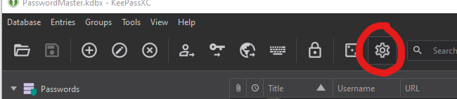
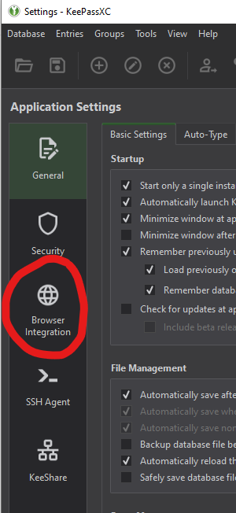
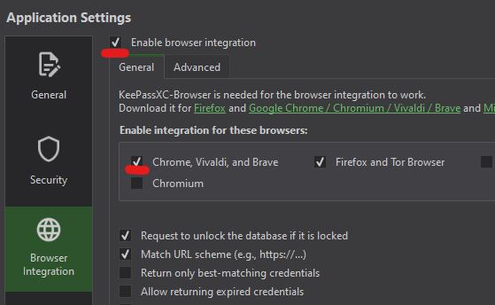
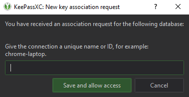
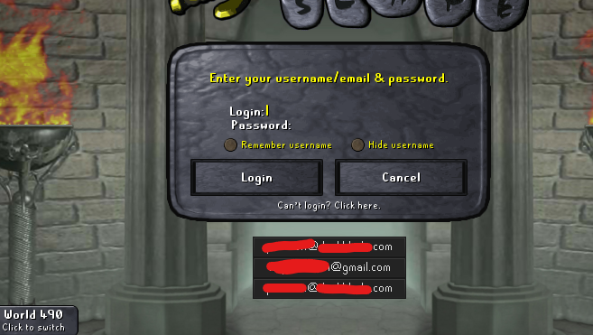

### keepassxc-runelite

This plugin allows for signing into OSRS 
via credentials stored in a KeePassXC database.
Uses the same connection interface as the KeePassXC browser plugin.
Password entries must have their URL set as
`https://secure.runescape.com`
to be recognized.

### Usage

You will need to enable the Chrome browser extension integration,
if you do not already have it enabled.

In KeePassXC 2.6.2:

Once this is enabled, you can start the plugin,
which will request access to your password database.
Give it a name you can identify, like "RuneLite",
then click "Save and allow access".

At this point, RuneLite should display your usernames on the login screen,
which can be clicked to auto-fill your credentials.
If it is your first time accessing credentials through the browser integration,
you may be prompted with an additional confirmation.

